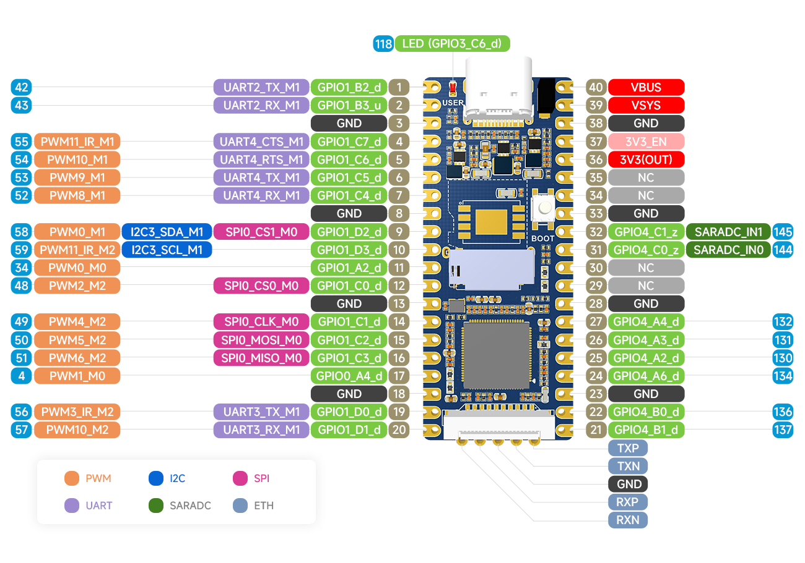

# Preface

This repository is about the reverse-engineering of the the CSIT badge I looted at DEFCon Singapore 2026.

The original software of the badge can only blink its LEDs and display contents of the SD card, but the board has a whole bunch of things to utilize: The RockChip itself is equipped with 2D graphics acceleration and neural network processing core, it runs Linux with Python support, it has Ethernet hardware even if the magnetics and the connector is absent, it has controls and it has a whole USB peripheral infrastructure extensible with extra ports. A whole cool wearable mini-computer can be made of it! 

# Repo Contents

* I copied the app scripts and uploaded them to the `root` folder.
* I also uploaded 2 different console logs to the `screenlog` folder
  * `screenlog.0` is the normal mode, we can see the Linux kernel booting. 
  * `screenlog.1` is when I keep the __boot__ button pressed when turning on.
 
# Hardware Briefing

The **Luckfox Pico Plus** SBC with **Rockchip RV1106** SoC provides 64 MiB RAM, GPIO, ADC, i2c, NPU, RGA, CSI camera port, Ethernet PHY, USB-C port, and **128 MiB Winbond SPI NAND** flash device. It runs **Buildroot Linux 5.10 (uClibc)** with **U-Boot 2017.09**.

The **CSIT Badge** surrounding completes it by adding LCD, 3 GPIO inputs (OK button and a top-down navigating joystick), 4 **WS2812B** RGB LEDs, audio amplifier with speaker, and a whole USB peripheral infrastructure consisting a line switch, a 4-port hub, an SD card reader device, and free slots wired to test pins. Finally, the board also has a second USB port, which is wired to a **CH340N** chip to provide USB-to-serial interface for console access. 

## USB strange things

RockChip RV1106 has only one USB port, that port already has an USB-C connector on the LuckFox Pico board, and the USB line is not exposed to the pins on the corner of the board, but, it is exposed to test pins on the bottom of the board. Those test pins are probably utilized by the badge to wire its peripheral infrastructure to the LuckFox, so the peripheral provided by the board and the USB-C connector of the LuckFox is electrically the same. 

This design comes with a benefit: I can connect my PC to that peripheral infrastructure by plugging my PC into the USB-C port of the LuckFox, so I can use the board as an USB hub / SD card reader without involving the LuckFox board. That's cool, and it works, but one thing confuses me: two host devices wired to the same peripheral should  cause a conflict. Why they don't? 

I guessed that's why we have the USB switch device: it could disconnect the LuckFox's USB from the peripheral and let my PC be the only host device if I connect my PC to that port. That would make sense. But, the case is not that simple, because the RockChip is wired to the USB-C port of the LuckFox outside of our board, and so the line switch can only break the line to the devices on the board, not the line between my PC and the LuckFox. 

Another possible explanation is that the RockChip becomes a peripheral instead of a host device if I connect my PC to it. And it's very likely because that USB-C port is designed to flash the device. So, my PC becomes the only hosts, because the LuckFox proactively withdraw it's host role. But, in this case, the USB hub on the badge and the LuckFox board is two peripheral gets wired to the same bus without a hub, which is also conflicting. In this case, the line switch can resolve the conflict by disconnecting the peripheral, but it does not do that, as I can see the SD card reader from my PC. And I don't see the LuckFox. 

This is something I am still trying to understand, but it does not stop us from utilizing the board. 
Anyways, CSIT did a great job hiding clues on the badge and making people learn :) 

## Bill Of Materials

| Item | Value | Spec Link |
|------|-------|-----------| 
| Board | Luckfox Pico Plus | https://www.luckfox.com/EN-Luckfox-Pico |
| SoC | Rockchip RV1106 | https://rockchip.fr/RV1103%20datasheet%20V1.5.pdf |
| Flash | WinBond 25N01KVZEIR | https://www.marthel.pl/katalog/W25N01KVxxxR_Datasheet_Rev.F_20230418.pdf |
| USB hub | CoreChip SL2.1A | https://www.graylogix.in/wp-content/uploads/2025/07/2409271302_CoreChips-SL2-1A_C192893.pdf |
| USB SD card reader | Genesys GL823K | https://w.electrodragon.com/w/images/c/cb/GL823K.pdf |
| USB switch | FSUBS42 | https://www.mouser.com/datasheet/2/149/FSUSB42-112719.pdf |
| USB to UART | CH340N | https://www.lcsc.com/datasheet/C2977777.pdf |
| Audio Amplifier | LM4890S | https://www.ti.com/lit/ds/symlink/lm4890.pdf |
| Level Translator | YF08E | https://cdn.sparkfun.com/assets/1/8/1/e/2/txs0108e.pdf |

## Pinouts

# OS Briefing

## TTY

The USB1 port enumerates an USB-to-UART interface which runs at baud __115200__

## Credentials

- Username: `root`
- Password: `luckfox`

## Mount Points

| Mount Point | Device | Size | Function |
|-------------|--------|------|----------|
| `/` | `/dev/ubi0_0` | 85M | Root Filesystem |
| `/oem` | `/dev/ubi4_0` | 30M | RockChip-specific demo binaries |
| `/userdata` | `/dev/ubi5_0` | 6M | A dedicated space for user-data |

Other, non-mounted partitions are:
- `env`
- `uboot`
- `boot`

# Devices

## CPU

### Parameters

| Function | Device | Notes | 
|----------|--------|-------| 
| Frequency | `/sys/devices/system/cpu/cpu0/cpufreq/scaling_max_freq` | `600000` = 600 MHz |
| Temperature | `/sys/class/thermal/thermal_zone0/` | TSADC | 

### Features

| Short | Function | Device | Notes |
|-------|----------|--------|-------|
| NPU | Neural-network Processing Unit | `/dev/rknpu` | RKNPU v0.9.2; 0.5 TFLOPS |
| RGA | Raster Graphics Accelerator | `/dev/rga` | |

## LCD

`ST7789V` connected via SPI, driven by `fb_st7789v`.

| Function | Dev File | Notes |
|----------|----------|-------| 
| Framebuffer | `/dev/fb0` | 320×240, RGB565le inverted |
| Backlight | `/sys/class/backlight/fb_st7789v/bl_power` | `0`=on, `4`=off |
| Backlight | `/sys/class/backlight/fb_st7789v/brightness` | | 
| Info | `/sys/class/graphics/fb0/virtual_size` | |
| Info | `/sys/class/graphics/fb0/bits_per_pixel` | | 

### Useful Commands

Display webcam image:
`ffmpeg -f v4l2 -video_size 320x240 -input_format mjpeg -i /dev/video0 -pix_fmt rgb565le -vf "transpose=2,negate" -f fbdev /dev/fb0`

#### Fills

| Color | Command |
|-------|---------|
| Red | `yes "$(printf '\x1f\x00')" \| tr -d '\n' \| dd of=/dev/fb0 bs=480 count=320 iflag=fullblock` |
| Green | `yes "$(printf '\x00\xf8')" \| tr -d '\n' \| dd of=/dev/fb0 bs=480 count=320 iflag=fullblock` |
| Blue | `yes "$(printf '\x07\xff')" \| tr -d '\n' \| dd of=/dev/fb0 bs=480 count=320 iflag=fullblock` |
| Black | `yes "$(printf '\xff')" \| tr -d '\n' \| dd of=/dev/fb0 bs=480 count=320 iflag=fullblock` |
| White | `dd if=/dev/zero of=/dev/fb0 bs=480 count=320 iflag=fullblock` |

#### White Noises

| Speed | Command |
|-------|---------|
| Unlimited | `while :; do dd if=/dev/urandom of=/dev/fb0 bs=480 count=320 iflag=fullblock; done` |
| Controlled | `watch -n 0.1 dd if=/dev/urandom of=/dev/fb0 bs=480 count=320 iflag=fullblock` |

## RGB Leds

RGB led strip is four **WS2812B** chained together, connected to `/dev/ttyS3`  
The proper settings for the UART interface is `ff4d0000` (2.4 Mbaud, 7N1)

## ADC 

| PIN Number | PIN Name | Device | 
|------------|----------|--------|
| 31 | 4C0 | `/sys/bus/iio/devices/iio:device0/in_voltage0_raw` |
| 32 | 4C1 | `/sys/bus/iio/devices/iio:device0/in_voltage1_raw` |

The scale is the same for the 2 inputs:  
`/sys/bus/iio/devices/iio:device0/in_voltage_scale`

