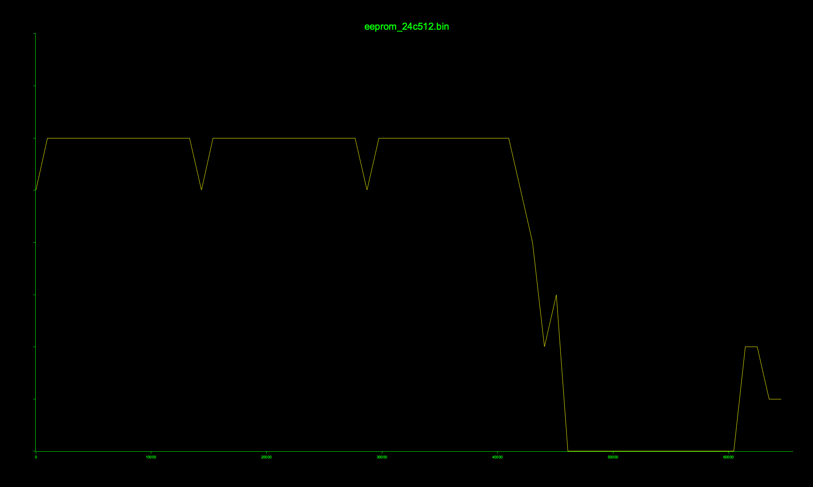

# BOM

| Chip | Function |
|------|----------|
| CSR 1010 A05U | Bluetooth LE SoC | 
| FM24C5120 | FRAM Serial Memory | 

# Header

1. `GND`
2. `DEBUG_CLK` (SoC PIN 18)
3. `DEBUG_CS` (SoC PIN 19)
4. `DEBUG_MOSI` (SoC PIN 20)
5. `DEBUG_MISO` (SoC PIN 22)
6. `DEBUG_EN` (SoC PIN 26)

# Test Pins

* `TX` (SoC PIN 14: `UART_TX`)

# Firmware

By wiretapping the `SCL`, `SDA`, `GND` and `VCC` pins of the `24C5120` and performing an i2c scanning through my ch347 chip, I can find the device `0x50` and read its contents.

I uploaded it here: [firmware](flash/eeprom_24c512.bin)

The entropy looks like this:  

# Observations

Pulling up PIN 23 (PIO9) of the SoC turns on the leds in blue color. 
