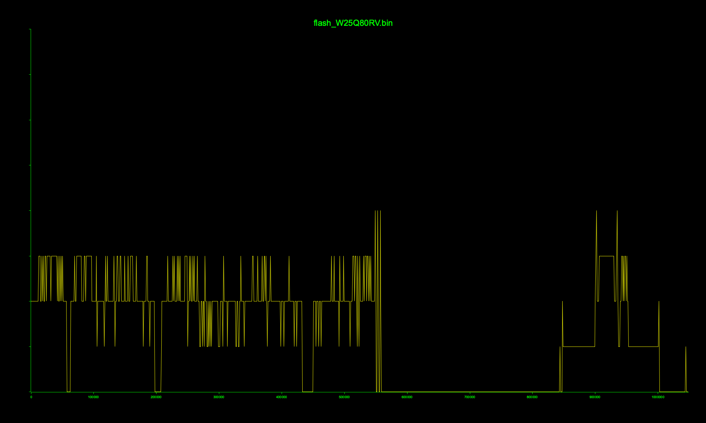

# TinyAudio C5 intro

## From user POV

Found in a Flea Market in Gyor for 500 HUF. Bought it becasue I had no idea what is it, and it's a kind of fun to discover. It gets power from Micro-USB, and instantly turned on when I plugged in. It is a smart audio box for old car radios: it can receive DAB stations or connect to my phone to receive Bluetooth audio, and output the received signal in line-level output, so it can be connected to the AUX of the car. 

It has lots of controls: it has a simple color TFT screen, one rotary encoder for menu navigation, 8 buttons in the top for easy-access radio presets, and 4 function buttons in the front. 

## From hacker POV

The thing that makes it interesting, is that it's a hardware-hacking honeypot: not hacked by anybody else before, and lots of debug interfaces exposed to the PCB with labels. It's like a virgin whore. And, it is very primtive: it's software is on an 1Mb flash chip, which makes it comfortable to analyze, while it still has recognizeable assets (images, etc...)

# From the inside

## Pins

* Headers: 
  * ????: `3V3`, `GND`, `RST`, `CLK`, `DAT` 
  * JTAG: `3V3`, `GND`, `TCK`, `TDO`, `TDI`, `TMS`
  * USB: `GND`, `5V`, `TX`, `GND`
* Known test pins:
  * Audio: `MIC+`, `MIC-`, `SP+`, `SP-`, `LIN`
  * Power: `GND`, `5V`, `3V3`, `MCU_3.3V`
  * ADC: `ADC0`, `ADC1`, `ADC2`
  * USB: `D+`, `D-`, `USBGND`
  * RF: `RFIN`, `RF_1.8V`,
  * AUX: `RO`, `LO`
  * BT: `BT_3.3V`
  * FM: `FM_TX`
* Unknown test pins: 
  * `TEST`
  * `RIN` 

# BOM

## Mainboard

| chip | function |
|------|----------|
| D-TEK DT666A-SF | Main CPU | 
| MTV301 | DAB SoC (???) |
| 25Q16CS1G | Serial Flash Memory |
| WinBond W25Q80JVS | 8 M-BIT SPI Flash Memory |
| Enspert NX3131 | Auto-industry DAB chip |
| NAU88C22 | Audio codec with speaker driver | 

## BT Daughterboard

| chip | function |
|------|----------|
| CSR 57F68 | Bluetooth transceiver |
| P24C64C | i2c Serial EEPROM | 

# Flash contents

I can read the contents of the W25Q80JVS with this command if I hold the CPU in reset:  
`flashrom -V -p ch347_spi -c W25Q80RV -r flash.bin`  
I also uploaded the 1Mb dump here as `flash/W25Q80JVS.bin`

Running a `binwalk` does not find anything useful, and the entropy is interesting but not very revealing.

but I had the idea that the welcome picture must be somewhere in this dump, and it must be a bitmap, as JPEG-decoding would be an overkill for this device. And, the whole dump is just 1Mb, so I created a python script that can display the whole thing as an image interpreted in different pixel formats, and it was a success, as it revealed the boot logo at the end of the memory dump.

`RGB565be` is the right pixel format, but padded to 4-byte blocks by duplicating the 2-byte long RGB565be pixels in each block. The logo is 160x240 pixels (so `4x160x240` bytes), and the image area starts at offset `0xCEF40`, so it can be exported with this command:  
`dd if=flash_W25Q80RV.bin of=logo_purple.bin bs=1 skip=$((0xCEF40)) count=$((160*240*4))`

If I convert this area of the memory with [convert.py](flash/logo/convert.py), I get this:  

